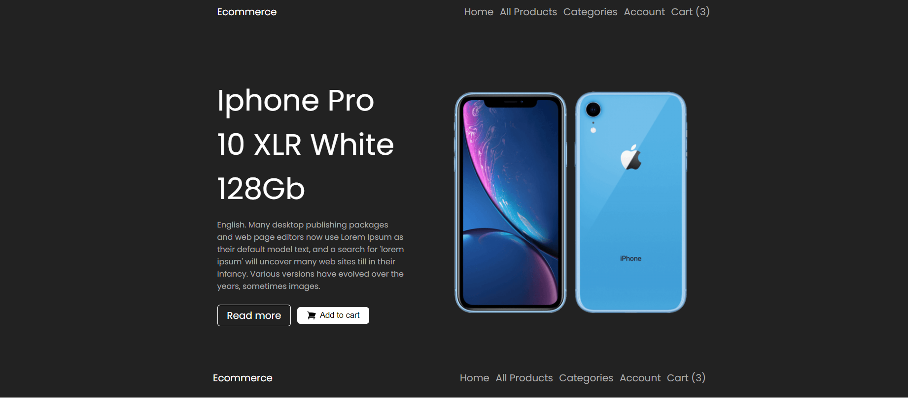
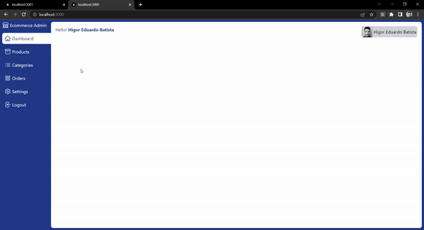

# :desktop_computer: Shoe Ecommerce Application

## :briefcase: Stacks

✅ JavaScript
✅ React
✅ NextJs
✅ noSQL
✅ Mongo
✅ TailwindCSS
✅ Stripe

## :hammer: Tools

- Git (`git -v`)
- NodeJs (`node --version`/`npm --version`)
- Yarn (`npm install --global yarn`/`yarn --version`)
- VS Code
- Http Server: (`npm install -g http-server`/`http-server ./`)

## :fire: Run

- Admin Development (Port 3000): `yarn dev`
- Web Development (Port 3001): `yarn dev`

## :baby: Created

- Admin: `yarn create next-app admin`
- Web: `yarn create next-app web`

## :ok_man: Dependencies

- Admin Dependencies: `yarn add @next-auth/mongodb-adapter axios mongodb mongoose next-auth react-sortablejs react-spinners react-sweetalert2 react-toastify sortablejs`
- Web Dependencies: `yarn add axios mongoose react-toastify stripe styled-components`

## :triangular_flag_on_post: Environment Variables

### Admin Variables

- Mongo URL: `MONGODB_URI`
- Google ID: `GOOGLE_ID`
- Google Secret: `GOOGLE_SECRET`

### Web Variables

- Mongo URL: `MONGODB_URI`
- Api Url (http-server): `NEXT_PUBLIC_API_URL`
- Next Url: `NEXT_PUBLIC_URL`
- Stripe Key: `STRIPE_PK`
- Stripe Secret: `STRIPE_SK`

## :page_facing_up: Docs

<b>Documentações</b>

### :scroll: Documentações

- Next: `https://nextjs.org/`
- Next Auth: `https://next-auth.js.org/`
- Sortable: `https://www.npmjs.com/package/react-sortablejs`
- Spinners: `https://www.npmjs.com/package/react-spinners`
- Sweet Alert: `https://www.npmjs.com/package/sweetalert2`
- Toastify: `https://www.npmjs.com/package/react-toastify`
- Stripe: `https://stripe.com`
- Axios: `https://axios-http.com/`
- Mongo: `https://www.mongodb.com/`
- TailwindCSS: `https://tailwindcss.com/`
- Styled Components: `https://styled-components.com/`

